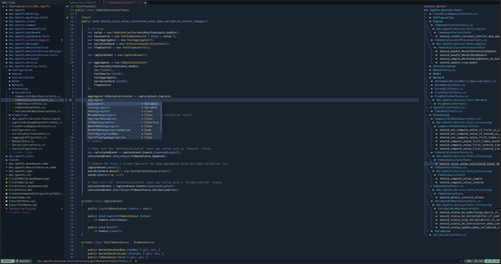

# Neovim

Lua-based configuration for Neovim based on [LazyVim](https://github.com/LazyVim/LazyVim).

# Installation

## Neovim

First, install Neovim on your favorite operating system

### Windows

`winget install Neovim.Neovim`

### Linux

Download latest release from [GitHub](https://github.com/neovim/neovim/releases) and use the provided
package file for your distribution.

For debian,

```
dpkg -i  nvim-linux64.deb
```

## Font

To work properly, some plugins need a patched font with third party glyphs.
You can install and configure your terminal to use one of the [nerdfont](https://www.nerdfonts.com/) font

## Configuration

After downloading neovim, copy the configuration folder in the neovim configuration folder:

### Windows

Copy the `nvim` folder to your `AppData\Local` folder

### Linux

Copy the `nvim` folder to `~/.config` folder

## Keymaps

The configuration is based on `LazyVim` and share the same default [keymaps](https://www.lazyvim.org/keymaps)

### Leader

The leader key is `space`

### Test Runner

To run tests, press `<leader>t`, then

* `r`: run the nearest test
* `f`: run all the tests from the current file
* `a`: run all the tests from the current suite

### Telescope

To run [telescope](https://github.com/nvim-telescope/telescope.nvim), press:

* `<C-f>`: find in files (grep)
* `<C-b>`: find buffers
* `<C-p>`: find files
